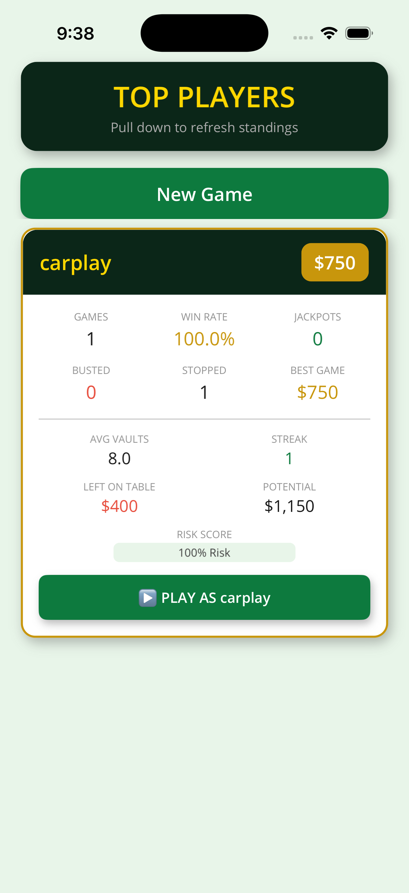
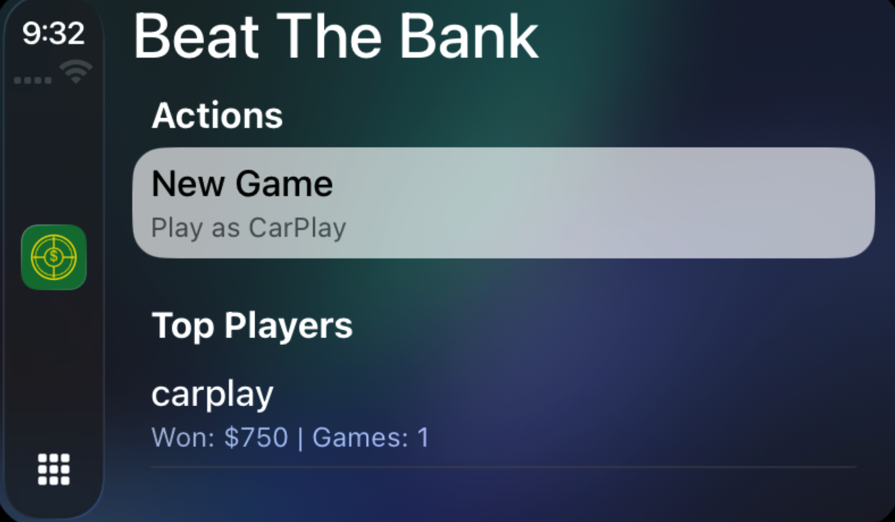
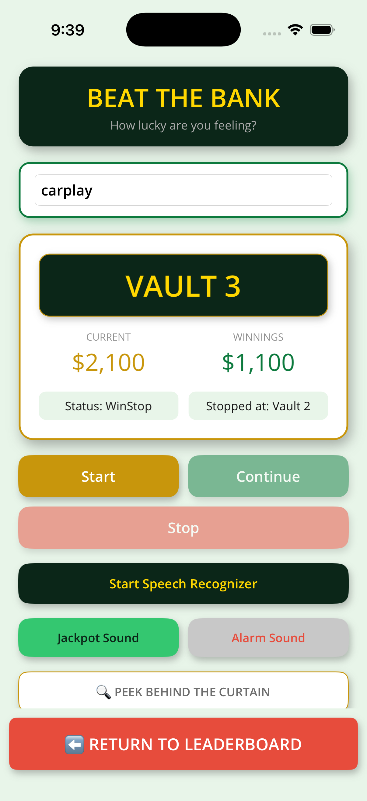
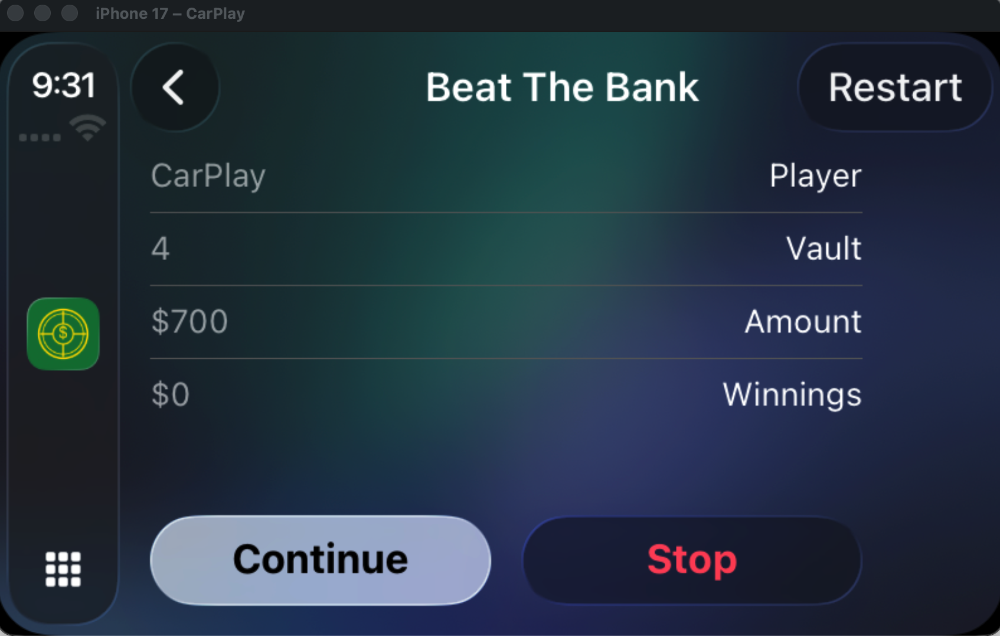
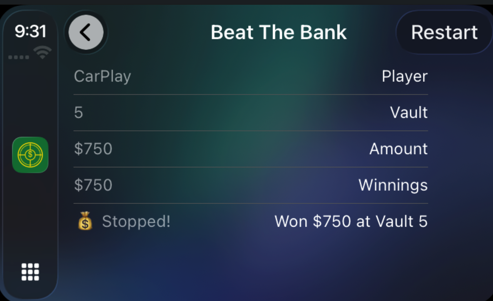

# Beat The Bank

A fun little speech-to-text/text-to-speech game built with .NET MAUI. My kids love this game on the radio called "Beat the Bank". Basically, you keep asking the announcer to continue. If you get lucky, the amount keeps going up per "vault". If you're really lucky, you win the jackpot, and if you aren't lucky at all - you hit the alarm and get nothing.

This game is not designed to look pretty, in fact, it looks quite disgusting as with all of my samples. I do pretty code, not pretty UI.

The main objectives were:
* Please kids
* Show off speech to text
* Show off text to speech
* Show off structured pretty code
* Show off carplay with .NET MAUI
* Track player stats and crown the vault-cracking champion

## Screenshots

| Phone | CarPlay |
|-------|---------|
|  |  |
|  |  |
| |  |

## How It Works

Think of it like a high-stakes game show... except nobody loses real money and your phone is the host!

1. **Tell it your name** - type it in or just say "My name is ..." like a boss
2. **Hit Start** - your virtual vault-cracking adventure begins
3. **Open vaults** - each one adds cold hard (fake) cash to your pile ($50 to $1,000 per vault!)
4. **Keep going or bail** - say "continue" to push your luck, or "stop" to walk away with your winnings
5. **Cross your fingers** - somewhere between vault 4 and 15, the game ends. Hit the jackpot? You just won **$1,000,000**! Hit the alarm? You get a sad buzzer and exactly $0.

The catch? There's a 1-in-40 chance of hitting the jackpot. So the real question is... do you feel lucky?

### Voice Commands

Why tap buttons when you can yell at your phone? Enable the speech recognizer and use these voice commands:

| Say This | What Happens |
|----------|-------------|
| "yes", "next", "keep going", "continue", "go" | Opens the next vault |
| "no", "stop" | Walk away with your winnings |
| "try again", "start over", "restart" | New game, fresh luck |
| "my name is [name]" | Sets your player name hands-free |

### Sound Effects

Two carefully curated audio experiences:
- **Jackpot sound** - the sweet, sweet sound of victory (you'll hear this approximately never)
- **Alarm sound** - the soul-crushing buzzer of defeat (you'll hear this a lot)

## Player Stats & Leaderboard

Every game you play is remembered forever (well, until you uninstall the app). The game tracks an absurd amount of stats per player because data is fun:

| Stat | What It Means |
|------|--------------|
| **Games Played** | How many times you've tempted fate |
| **Total Won** | Your lifetime fake fortune |
| **Potential Winnings** | What the vaults actually held (prepare for regret) |
| **Jackpots Hit** | Times you beat the 1-in-40 odds |
| **Times Busted** | Alarm-induced heartbreaks |
| **Times Stopped** | When wisdom prevailed over greed |
| **Best Single Game** | Your greatest heist |
| **Avg Vaults/Game** | How deep you typically go before chickening out |
| **Win Rate** | Percentage of games you walked away with something |
| **Longest Streak** | Consecutive games without going bust |
| **Money Left on Table** | Total of what you could've won but bailed on (the "what if" stat) |
| **Risk Score** | How aggressively you open vaults relative to the total available - higher = more daring |

Player names are matched **case-insensitively**, so "Allan", "allan", and "ALLAN" are all the same vault-cracking legend.

Switch to the **Leaderboard** tab to see who's on top, ranked by total winnings. Pull down to refresh after crushing another game.

## Platforms

| Platform | Minimum Version |
|----------|----------------|
| Android | 5.0 (API 21) |
| iOS | 15.0 |
| macOS (Catalyst) | 15.0 |

## The Stack

| Library | Description |
|---------|-------------|
| [.NET MAUI](https://github.com/dotnet/maui) | The cross-platform framework that makes this whole thing possible |
| [Shiny MAUI Shell](https://github.com/shinyorg/maui) | Making .NET MAUI shiny to use - handles shell mapping and navigation like a champ |
| [Shiny Mediator](https://github.com/shinyorg/mediator) | Mediator pattern for clean command/query separation - save games, fetch stats, load leaderboards without spaghetti |
| [MVVM Community Toolkit](https://github.com/CommunityToolkit/dotnet) | Source-generated MVVM goodness - `[ObservableProperty]` and `[RelayCommand]` so you can write less boilerplate and more game logic |
| [MAUI Community Toolkit](https://github.com/CommunityToolkit/Maui) | Speech-to-text, text-to-speech, expander control, and a bunch of other handy bits |
| [MAUI Audio Plugin](https://github.com/jfversluis/Plugin.Maui.Audio) | Cross-platform audio playback for those satisfying jackpot jingles and devastating alarm buzzes |
| [sqlite-net-pcl](https://github.com/praeclarum/sqlite-net) | Lightweight SQLite ORM that stores every game result - your vault-cracking history lives on |
| [System.Reactive](https://github.com/dotnet/reactive) | Reactive Extensions for .NET - because sometimes you need to observe things reactively |

## Architecture

A two-tab app that punches well above its weight. Here's how it's put together:

- **MVVM pattern** with constructor-injected dependencies - clean, testable, and easy to follow
- **Primary constructors** in C# 12 - because life is too short for field assignments
- **Shiny Shell** with `[ShellMap]` attributes for declarative route registration and tab-based navigation
- **Shiny Mediator** for clean command/query separation - `SaveGameResultCommand`, `GetPlayerStatsRequest`, `GetLeaderboardRequest` all wired via source-generated handlers with `[MediatorSingleton]`
- **SQLite persistence** with lazy async initialization - the database creates itself on first access, no blocking startup
- **IPageLifecycleAware** to hook into page appearing/disappearing for resource management
- **Weighted random distribution** for vault amounts - $50 is rarer than $100-$1000, keeping things interesting
- **Platform-specific audio loading** via conditional compilation (`#if IOS`, `#elif MACCATALYST`, etc.)
- **Keep screen on** while playing - because nobody wants their phone going to sleep mid-heist

### Project Structure

```
BeatTheBank/
├── Models/
│   ├── GameResult.cs           # SQLite entity - every game, immortalized
│   └── PlayerStats.cs          # 13 stats computed from game history
├── Contracts/
│   ├── SaveGameResultCommand.cs    # ICommand - persist a finished game
│   ├── GetPlayerStatsRequest.cs    # IRequest - stats for one player
│   └── GetLeaderboardRequest.cs    # IRequest - top N players
├── Handlers/
│   ├── SaveGameResultHandler.cs    # Writes game results to SQLite
│   ├── GetPlayerStatsHandler.cs    # Computes stats from game history
│   └── GetLeaderboardHandler.cs    # Single query, groups by player, sorts by riches
├── Services/
│   ├── GameDatabase.cs         # SQLite wrapper with lazy async init
│   └── StatsCalculator.cs      # Shared stats math - DRY and testable
├── MainViewModel.cs            # Game logic + saves results via mediator
├── MainPage.xaml               # The vault-cracking UI
├── LeaderboardViewModel.cs     # Loads leaderboard on tab appear
├── LeaderboardPage.xaml        # CollectionView of player stat cards
├── AppShell.xaml               # TabBar: Play | Leaderboard
└── MauiProgram.cs              # DI wiring for everything
```
